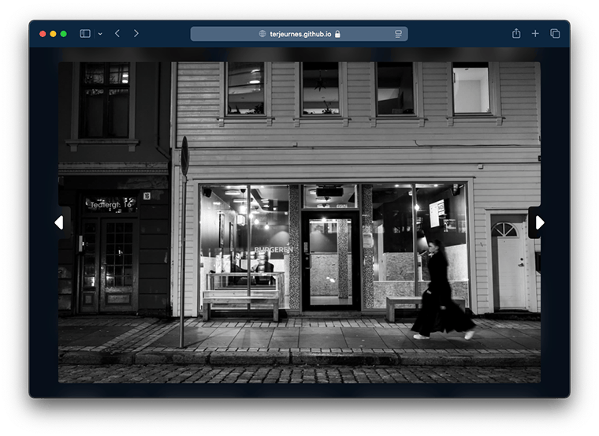

Simple fullscreen image viewer.  
In pure vanilla JavaScript with no dependencies.  
It finds the images on the page. Ether all images or only those that is marked.
# Image Viewer JS



## How to use

Just include the file [imageviewer.js](./imageviewer.js) and make a instance of the class `ImageViewer`. And include the icons folder or use your own icons, see under customization possibilities. 

```javascript
new ImageViewer();
```
The instance have to be created after the page is finish loading.

## Image Scraping: All images

The default is to collect tagged images. To collect all set `SELECT_ALL_IMAGES` to true.

```javascript
new ImageViewer({
    "select_all_images": "true"
})
```

## Image Scraping: Marked images
A image is marked if the image element has a mark or if a parent element is marked.
To mark is to ether add an attribute or a class. Default attribute is `data-gallery` and default class is `gallery`.

```html
<div class="img-styling" data-gallery>
    
    
</div>
<div class="img-styling">
    
    
</div>
```

To change the marks change the `GALLERY_MARK_ATTRIBUTE` or / and `GALLERY_MARK_CLASS`.

```javascript
new ImageViewer({
    "gallery_mark_attribute": "data-flowerimages",
    "gallery_mark_class": "images"
})
```

## Customization possibilities

|Description | Key | Default | Other |
|------------|-----|---------|-------|
| Background color and alpha | BACKGROUND_COLOR | "#0009" | |
| Background blur | BACKGROUND_BLUR | "15px" | |
| Frame size | IMAGE_MARGIN | "2em 3em" | |
| Arrows for moving between images | NAVIGATION_CONTROLS | "visible" | "hidden" |

| Icon | Key | Path |
|------|-----|------|
| Left arrow | LEFT_NAVIGATION_ARROW | "icons/caret-left-solid.svg" |
| Right arrow | RIGHT_NAVIGATION_ARROW | "icons/caret-right-solid.svg" |

```javascript
new ImageViewer({
    "background_color": "hotpink",
    "image_margin": "0",
    "left_navigation_arrow": "previous-button.png",
    "right_navigation_arrow": "next-button.png"
})
```
